# Analyse de données - Yohan Ruffieux
## LeRadeau-Data


```python
import pandas as pd

file_path = './data/LeRadeau-Data.xlsx'

df=pd.read_excel(file_path)
df
```


<div>
<style scoped>
    .dataframe tbody tr th:only-of-type {
        vertical-align: middle;
    }

    .dataframe tbody tr th {
        vertical-align: top;
    }

    .dataframe thead th {
        text-align: right;
    }
</style>
<table border="1" class="dataframe">
  <thead>
    <tr style="text-align: right;">
      <th></th>
      <th>Risk</th>
      <th>Host</th>
      <th>ProductType</th>
      <th>Protocol</th>
      <th>Port</th>
      <th>Name</th>
      <th>Synopsis</th>
      <th>Solution</th>
      <th>See Also</th>
      <th>CVSS v3.0 Base Score</th>
      <th>VPR Score</th>
    </tr>
  </thead>
  <tbody>
    <tr>
      <th>0</th>
      <td>Medium</td>
      <td>192.168.71.1</td>
      <td>Firewall</td>
      <td>icmp</td>
      <td>0</td>
      <td>ICMP Timestamp Request Remote Date Disclosure</td>
      <td>It is possible to determine the exact time set...</td>
      <td>Filter out the ICMP timestamp requests (13), a...</td>
      <td>NaN</td>
      <td>4.0</td>
      <td>0.8</td>
    </tr>
    <tr>
      <th>1</th>
      <td>Low</td>
      <td>192.168.71.1</td>
      <td>Firewall</td>
      <td>udp</td>
      <td>67</td>
      <td>DHCP Server Detection</td>
      <td>The remote DHCP server may expose information ...</td>
      <td>Apply filtering to keep this information off t...</td>
      <td>NaN</td>
      <td>NaN</td>
      <td>NaN</td>
    </tr>
    <tr>
      <th>2</th>
      <td>NaN</td>
      <td>192.168.71.1</td>
      <td>Firewall</td>
      <td>tcp</td>
      <td>0</td>
      <td>Nessus Scan Information</td>
      <td>This plugin displays information about the Nes...</td>
      <td>NaN</td>
      <td>NaN</td>
      <td>NaN</td>
      <td>NaN</td>
    </tr>
    <tr>
      <th>3</th>
      <td>Low</td>
      <td>192.168.71.1</td>
      <td>Firewall</td>
      <td>tcp</td>
      <td>22</td>
      <td>SSH Weak Key Exchange Algorithms Enabled</td>
      <td>The remote SSH server is configured to allow w...</td>
      <td>Contact the vendor or consult product document...</td>
      <td>https://datatracker.ietf.org/doc/html/rfc9142</td>
      <td>3.7</td>
      <td>NaN</td>
    </tr>
    <tr>
      <th>4</th>
      <td>Medium</td>
      <td>192.168.71.1</td>
      <td>Firewall</td>
      <td>tcp</td>
      <td>22</td>
      <td>SSH Terrapin Prefix Truncation Weakness (CVE-2...</td>
      <td>The remote SSH server is vulnerable to a mitm ...</td>
      <td>Contact the vendor for an update with the stri...</td>
      <td>https://terrapin-attack.com/</td>
      <td>5.9</td>
      <td>6.7</td>
    </tr>
    <tr>
      <th>...</th>
      <td>...</td>
      <td>...</td>
      <td>...</td>
      <td>...</td>
      <td>...</td>
      <td>...</td>
      <td>...</td>
      <td>...</td>
      <td>...</td>
      <td>...</td>
      <td>...</td>
    </tr>
    <tr>
      <th>102</th>
      <td>Low</td>
      <td>WLRA004</td>
      <td>Périphérique</td>
      <td>tcp</td>
      <td>2002</td>
      <td>SSL Certificate Chain Contains RSA Keys Less T...</td>
      <td>The X.509 certificate chain used by this servi...</td>
      <td>Replace the certificate in the chain with the ...</td>
      <td>https://www.cabforum.org/wp-content/uploads/Ba...</td>
      <td>NaN</td>
      <td>NaN</td>
    </tr>
    <tr>
      <th>103</th>
      <td>NaN</td>
      <td>WLRA009</td>
      <td>Périphérique</td>
      <td>tcp</td>
      <td>0</td>
      <td>Nessus Scan Information</td>
      <td>This plugin displays information about the Nes...</td>
      <td>NaN</td>
      <td>NaN</td>
      <td>NaN</td>
      <td>NaN</td>
    </tr>
    <tr>
      <th>104</th>
      <td>Medium</td>
      <td>WLRA009</td>
      <td>Périphérique</td>
      <td>tcp</td>
      <td>445</td>
      <td>SMB Signing not required</td>
      <td>Signing is not required on the remote SMB server.</td>
      <td>Enforce message signing in the host's configur...</td>
      <td>http://www.nessus.org/u?df39b8b3\nhttp://techn...</td>
      <td>5.3</td>
      <td>NaN</td>
    </tr>
    <tr>
      <th>105</th>
      <td>NaN</td>
      <td>WLTR015</td>
      <td>Périphérique</td>
      <td>tcp</td>
      <td>0</td>
      <td>Nessus Scan Information</td>
      <td>This plugin displays information about the Nes...</td>
      <td>NaN</td>
      <td>NaN</td>
      <td>NaN</td>
      <td>NaN</td>
    </tr>
    <tr>
      <th>106</th>
      <td>Medium</td>
      <td>WLTR015</td>
      <td>Périphérique</td>
      <td>tcp</td>
      <td>445</td>
      <td>SMB Signing not required</td>
      <td>Signing is not required on the remote SMB server.</td>
      <td>Enforce message signing in the host's configur...</td>
      <td>http://www.nessus.org/u?df39b8b3\nhttp://techn...</td>
      <td>5.3</td>
      <td>NaN</td>
    </tr>
  </tbody>
</table>
<p>107 rows × 11 columns</p>
</div>


Les colonnes à disposition sont les suivantes :


```python
df.info()
```

    <class 'pandas.core.frame.DataFrame'>
    RangeIndex: 107 entries, 0 to 106
    Data columns (total 11 columns):
     #   Column                Non-Null Count  Dtype  
    ---  ------                --------------  -----  
     0   Risk                  83 non-null     object 
     1   Host                  107 non-null    object 
     2   ProductType           107 non-null    object 
     3   Protocol              107 non-null    object 
     4   Port                  107 non-null    int64  
     5   Name                  107 non-null    object 
     6   Synopsis              107 non-null    object 
     7   Solution              83 non-null     object 
     8   See Also              48 non-null     object 
     9   CVSS v3.0 Base Score  74 non-null     float64
     10  VPR Score             27 non-null     float64
    dtypes: float64(2), int64(1), object(8)
    memory usage: 9.3+ KB
    

Suppression des colonnes qui me semblent inutiles pour l'analyse


```python
df_opti = df.drop(columns=['Synopsis','Solution','See Also'])
```

Un petit aperçu des valeurs vides dans le document :


```python
df_opti.isnull().sum()
```


    Risk                    24
    Host                     0
    ProductType              0
    Protocol                 0
    Port                     0
    Name                     0
    CVSS v3.0 Base Score    33
    VPR Score               80
    dtype: int64


```python
df_opti.isnull().sum().sum()
```


    np.int64(137)


Il y a un total de 137 valeurs vides, principalement à cause des scores manquants, ce n'est pas très grave, on peut partir du principe que les scores manquants sont des scores de 0, donc avec peu de risque.

## Distribution de certaines valeurs

### Distribution des types de produits


```python
df_opti['ProductType'].value_counts().plot(kind='bar', title='Distribution of Product Types', xlabel='Type of Product', ylabel='Number of Occurrences')
```


    <Axes: title={'center': 'Distribution of Product Types'}, xlabel='Type of Product', ylabel='Number of Occurrences'>


    
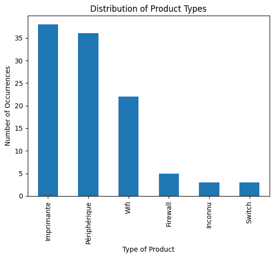
    


```python
risk_colors = {
    'Low': '#00FF00',  # Green
    'Medium': '#FFFF00',  # Yellow
    'High': '#FF0000',  # Red
    'Critical': '#990000'  # Dark red
}
```

### Distribution des risques


```python
risk = df_opti['Risk'].value_counts()

colors = [risk_colors[r] for r in risk.index]
risk.plot(kind='bar', title='Distribution of Risk', xlabel='Type of Risk', ylabel='Number of Occurrences', color=colors)
```


    <Axes: title={'center': 'Distribution of Risk'}, xlabel='Type of Risk', ylabel='Number of Occurrences'>


    
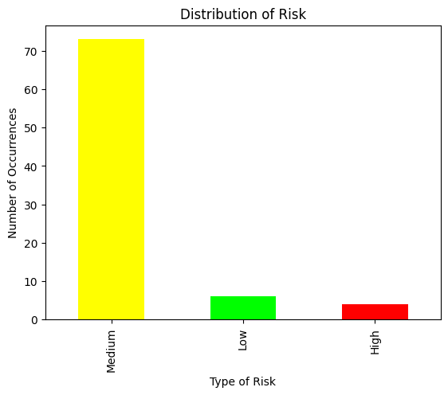
    


#### Distribution des risques en pourcentage


```python
risk.plot(kind='pie', autopct='%1.1f%%', title='Distribution of Risk', ylabel='', colors=colors)
```


    <Axes: title={'center': 'Distribution of Risk'}>


    
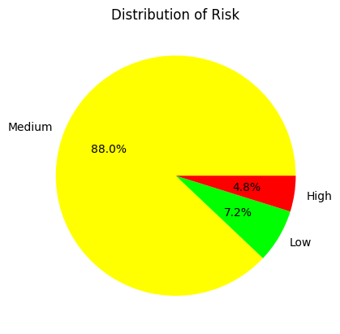
    


On peut voir qu'il y a une grande majorité d'alertes à risque moyen et qu'il y a très peu d'alertes à risque hauts, donc c'est plutôt rassurant.

### Graphique de la distribution des risques par type de produit


```python
risk_distribution = df_opti.groupby('ProductType')['Risk'].value_counts().unstack()
types = df_opti['ProductType'].unique()
```


```python
risk_distribution.plot(kind='bar', stacked=True, title='Risk Distribution by Product Type', xlabel='Type of Product', ylabel='Number of Occurrences', color=[risk_colors[r] for r in risk_distribution.columns])
```


    <Axes: title={'center': 'Risk Distribution by Product Type'}, xlabel='Type of Product', ylabel='Number of Occurrences'>


    
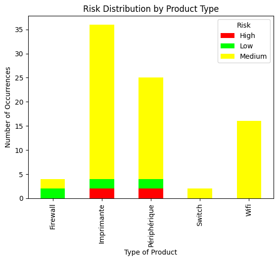
    


```python
from matplotlib import pyplot as plt

for type in types:
    if type != "Inconnu":
        risk = risk_distribution.loc[type].fillna(0)
        colors = [risk_colors[r] for r in risk.index]
        risk.plot(kind='pie', autopct='%1.1f%%', title=f'Distribution of Risk for {type}', ylabel='', colors=colors)
        plt.show()
```


    
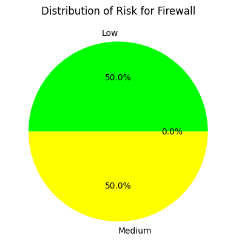
    


    
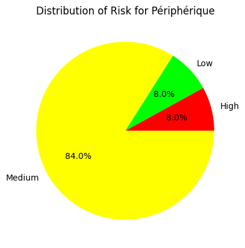
    


    
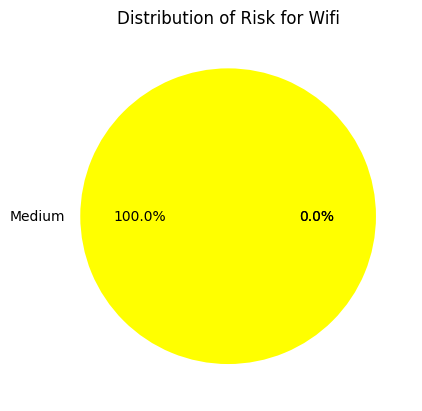
    


    
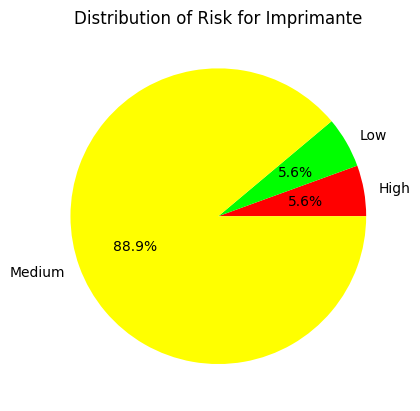
    


    
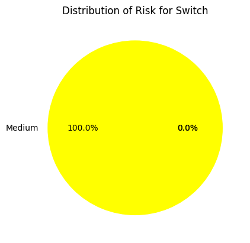
    


## Quelques statistiques
### Top 3 des types de machines avec le plus d'alertes


```python
total_alerts = df_opti.groupby('ProductType')['Risk'].count()
total_alerts = total_alerts.sort_values(ascending=False)
for productType, percentage in total_alerts.head(3).items():
    print(f'{productType}: {percentage} alerts in total')
    
```

    Imprimante: 36 alerts in total
    Périphérique: 25 alerts in total
    Wifi: 16 alerts in total
    

### Top 2 des types de machines avec le plus d'alertes à haut risque en pourcentage


```python
critical_alerts = df_opti[df_opti['Risk'] == 'High'].groupby('ProductType')['Risk'].count()
total_alerts = df_opti.groupby('ProductType')['Risk'].count()
critical_alerts_percentage = (critical_alerts / total_alerts).sort_values(ascending=False)
for type, percentage in critical_alerts_percentage.head(2).items():
    print(f'{type}: {percentage:.1%} of critical alerts')
```

    Périphérique: 8.0% of critical alerts
    Imprimante: 5.6% of critical alerts
    

### Le top 3 des host avec le plus d'alertes


```python
top_hosts = df_opti['Host'].value_counts().head(3)
top_hosts
```


    Host
    192.168.71.50    27
    i101             11
    192.168.71.67     9
    Name: count, dtype: int64


En voyant ça, on peut se dire qu'il faudrait regarder de plus près ces machines pour voir si il n'y a pas un problème de sécurité.

### Le top 3 des host avec le plus d'alertes à haut risque


```python
top_hosts_critical = df_opti[df_opti['Risk'] == 'High']['Host'].value_counts().head(3)
top_hosts_critical
```


    Host
    192.168.71.50    1
    192.168.71.67    1
    i101             1
    Name: count, dtype: int64


En voyant ces chiffres, on voit qu'il n'y a que une alerte à haut risque au maximum par machine, donc c'est plutôt rassurant.

### La distribution globale des scores CVSS et VPR
Rappel : plus on se rapproche de 10, plus le risque est élevé


```python
df_opti['CVSS v3.0 Base Score'].plot(kind='hist', title='Distribution of CVSS Scores', xlabel='CVSS Score',
                                     ylabel='Number of Occurrences')
plt.xlim(0, 10)
plt.xticks(range(0, 11))
plt.show()
```


    
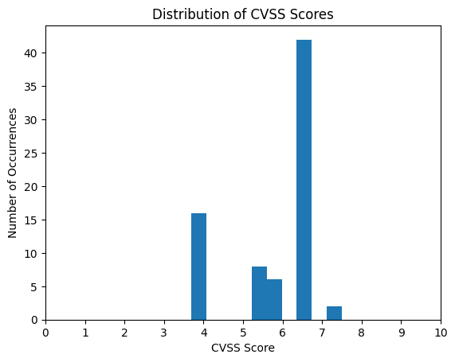
    


```python
df_opti['CVSS v3.0 Base Score'].mean()
```


    np.float64(5.804054054054054)


```python
df_opti['VPR Score'].plot(kind='hist', title='Distribution of VPR Scores', xlabel='VPR Score',
                          ylabel='Number of Occurrences')
plt.xlim(0, 10)
plt.xticks(range(0, 11))
plt.show()
```


    
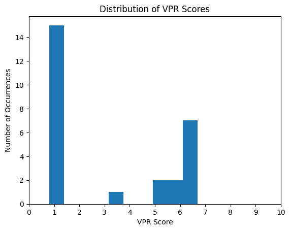
    


```python
df_opti['VPR Score'].mean()
```


    np.float64(3.1370370370370377)


Avec un score moyen de 5.8 et 3.1, on peut dire que les risques sont plutôt bas, ce qui est une bonne nouvelle.

### Le top 3 des ports qui provoquent le plus d'alertes


```python
top_ports = df_opti['Port'].value_counts().head(3)
top_ports
```


    Port
    0       39
    443     11
    8443     9
    Name: count, dtype: int64


On peut voir que les ports 443 et 8443 provoquent le plus d'alertes, le port 0 je pense que c'est un port par défaut qui est utilisé pour les alertes qui ne sont pas liées à un port spécifique, donc c'est normal qu'il soit en tête de liste.

### Le top 3 des ports qui provoquent le plus d'alertes à haut risque


```python
top_ports_critical = df_opti[df_opti['Risk'] == 'High']['Port'].value_counts().head(3)
top_ports_critical
```


    Port
    161     2
    8009    1
    2002    1
    Name: count, dtype: int64


On peut en conclure que les ports 161, 8009 et 2002 sont les plus critiques, il faudrait donc regarder de plus près ces ports pour voir si il n'y a pas un problème de sécurité.


```python
import os
os.system('jupyter nbconvert --to markdown LeRadeau-Data_Analyse.ipynb')
```
