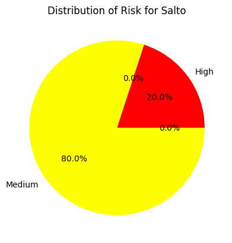

# Analyse de données - Yohan Ruffieux
## Singer_Graph


```python
import pandas as pd

file_path = './data/Singer_Graph2.xlsx'

# read the Excel file
excel_file = pd.ExcelFile(file_path)

dfs = []

# for each sheet in the Excel file, read the data into a DataFrame
for sheet_name in excel_file.sheet_names:
    df = pd.read_excel(file_path, sheet_name=sheet_name)
    df['Type'] = sheet_name  # add a column to identify the type of data
    dfs.append(df)

# combine all the DataFrames into a single DataFrame
combined_df = pd.concat(dfs, ignore_index=True)

combined_df
```


<div>
<style scoped>
    .dataframe tbody tr th:only-of-type {
        vertical-align: middle;
    }

    .dataframe tbody tr th {
        vertical-align: top;
    }

    .dataframe thead th {
        text-align: right;
    }
</style>
<table border="1" class="dataframe">
  <thead>
    <tr style="text-align: right;">
      <th></th>
      <th>Risk</th>
      <th>Host</th>
      <th>Protocol</th>
      <th>Port</th>
      <th>Name</th>
      <th>Synopsis</th>
      <th>Solution</th>
      <th>See Also</th>
      <th>CVSS v3.0 Base Score</th>
      <th>VPR Score</th>
      <th>Type</th>
    </tr>
  </thead>
  <tbody>
    <tr>
      <th>0</th>
      <td>Low</td>
      <td>10.128.32.1</td>
      <td>tcp</td>
      <td>23</td>
      <td>Telnet Server Detection</td>
      <td>A Telnet server is listening on the remote port.</td>
      <td>Disable this service if you do not use it.</td>
      <td>NaN</td>
      <td>NaN</td>
      <td>NaN</td>
      <td>Servers</td>
    </tr>
    <tr>
      <th>1</th>
      <td>NaN</td>
      <td>10.128.32.1</td>
      <td>tcp</td>
      <td>0</td>
      <td>Nessus Scan Information</td>
      <td>This plugin displays information about the Nes...</td>
      <td>NaN</td>
      <td>NaN</td>
      <td>NaN</td>
      <td>NaN</td>
      <td>Servers</td>
    </tr>
    <tr>
      <th>2</th>
      <td>Medium</td>
      <td>10.128.32.1</td>
      <td>tcp</td>
      <td>23</td>
      <td>Unencrypted Telnet Server</td>
      <td>The remote Telnet server transmits traffic in ...</td>
      <td>Disable the Telnet service and use SSH instead.</td>
      <td>NaN</td>
      <td>6.5</td>
      <td>NaN</td>
      <td>Servers</td>
    </tr>
    <tr>
      <th>3</th>
      <td>Low</td>
      <td>10.128.32.1</td>
      <td>tcp</td>
      <td>22</td>
      <td>SSH Server CBC Mode Ciphers Enabled</td>
      <td>The SSH server is configured to use Cipher Blo...</td>
      <td>Contact the vendor or consult product document...</td>
      <td>NaN</td>
      <td>3.7</td>
      <td>3.6</td>
      <td>Servers</td>
    </tr>
    <tr>
      <th>4</th>
      <td>Low</td>
      <td>10.128.32.1</td>
      <td>tcp</td>
      <td>22</td>
      <td>SSH Weak MAC Algorithms Enabled</td>
      <td>The remote SSH server is configured to allow M...</td>
      <td>Contact the vendor or consult product document...</td>
      <td>NaN</td>
      <td>NaN</td>
      <td>NaN</td>
      <td>Servers</td>
    </tr>
    <tr>
      <th>...</th>
      <td>...</td>
      <td>...</td>
      <td>...</td>
      <td>...</td>
      <td>...</td>
      <td>...</td>
      <td>...</td>
      <td>...</td>
      <td>...</td>
      <td>...</td>
      <td>...</td>
    </tr>
    <tr>
      <th>3673</th>
      <td>Low</td>
      <td>10.128.134.139</td>
      <td>tcp</td>
      <td>22</td>
      <td>SSH Server CBC Mode Ciphers Enabled</td>
      <td>The SSH server is configured to use Cipher Blo...</td>
      <td>Contact the vendor or consult product document...</td>
      <td>NaN</td>
      <td>3.7</td>
      <td>3.6</td>
      <td>Printers</td>
    </tr>
    <tr>
      <th>3674</th>
      <td>Low</td>
      <td>10.128.134.139</td>
      <td>tcp</td>
      <td>22</td>
      <td>SSH Weak MAC Algorithms Enabled</td>
      <td>The remote SSH server is configured to allow M...</td>
      <td>Contact the vendor or consult product document...</td>
      <td>NaN</td>
      <td>NaN</td>
      <td>NaN</td>
      <td>Printers</td>
    </tr>
    <tr>
      <th>3675</th>
      <td>Medium</td>
      <td>10.128.134.139</td>
      <td>udp</td>
      <td>161</td>
      <td>SNMP 'GETBULK' Reflection DDoS</td>
      <td>The remote SNMP daemon is affected by a vulner...</td>
      <td>Disable the SNMP service on the remote host if...</td>
      <td>http://www.nessus.org/u?8b551b5c</td>
      <td>NaN</td>
      <td>3.6</td>
      <td>Printers</td>
    </tr>
    <tr>
      <th>3676</th>
      <td>Critical</td>
      <td>10.128.134.139</td>
      <td>tcp</td>
      <td>22</td>
      <td>Dropbear SSH Server &lt; 2016.72 Multiple Vulnera...</td>
      <td>The SSH service running on the remote host is ...</td>
      <td>Upgrade to Dropbear SSH version 2016.74 or later.</td>
      <td>https://matt.ucc.asn.au/dropbear/CHANGES</td>
      <td>9.8</td>
      <td>5.9</td>
      <td>Printers</td>
    </tr>
    <tr>
      <th>3677</th>
      <td>Low</td>
      <td>10.128.134.139</td>
      <td>tcp</td>
      <td>22</td>
      <td>SSH Weak Key Exchange Algorithms Enabled</td>
      <td>The remote SSH server is configured to allow w...</td>
      <td>Contact the vendor or consult product document...</td>
      <td>https://datatracker.ietf.org/doc/html/rfc9142</td>
      <td>3.7</td>
      <td>NaN</td>
      <td>Printers</td>
    </tr>
  </tbody>
</table>
<p>3678 rows × 11 columns</p>
</div>


Les colonnes à disposition sont les suivantes :


```python
combined_df.info()
```

    <class 'pandas.core.frame.DataFrame'>
    RangeIndex: 3678 entries, 0 to 3677
    Data columns (total 11 columns):
     #   Column                Non-Null Count  Dtype  
    ---  ------                --------------  -----  
     0   Risk                  1874 non-null   object 
     1   Host                  3678 non-null   object 
     2   Protocol              3678 non-null   object 
     3   Port                  3678 non-null   int64  
     4   Name                  3678 non-null   object 
     5   Synopsis              3678 non-null   object 
     6   Solution              2385 non-null   object 
     7   See Also              2015 non-null   object 
     8   CVSS v3.0 Base Score  1537 non-null   float64
     9   VPR Score             668 non-null    float64
     10  Type                  3678 non-null   object 
    dtypes: float64(2), int64(1), object(8)
    memory usage: 316.2+ KB
    

Suppression des colonnes qui me semblent inutiles pour l'analyse


```python
df_opti = combined_df.drop(columns=["Synopsis", "Solution", "See Also"])
```

Un petit aperçu des valeurs vides dans le document :


```python
df_opti.isnull().sum()
```


    Risk                    1804
    Host                       0
    Protocol                   0
    Port                       0
    Name                       0
    CVSS v3.0 Base Score    2141
    VPR Score               3010
    Type                       0
    dtype: int64


```python
df_opti.isnull().sum().sum()
```


    np.int64(6955)


il y a un total de 6955 valeurs vides dans le document, je ne pense pas que c'est un problème dans notre cas. Les valeurs vide sont en général pour les colonnes des scores et du risque. On peut partir du principe que si ces valeurs sont vides, c'est qu'il n'y a pas de risque.

## Distribution de certaines valeurs

### Distribution des types de produits


```python
df_opti['Type'].value_counts().plot(kind='bar', title='Distribution of the type of product', xlabel='Type of product', ylabel='Number of Occurrences')
```


    <Axes: title={'center': 'Distribution of the type of product'}, xlabel='Type of product', ylabel='Number of Occurrences'>


    

    


```python
risk_colors = {
    'Low': '#00FF00',  # Green
    'Medium': '#FFFF00',  # Yellow
    'High': '#FF0000',  # Red
    'Critical': '#990000'  # Dark red
}
```

### Distribution des risques


```python
risk = df_opti['Risk'].value_counts()

colors = [risk_colors[r] for r in risk.index]
risk.plot(kind='bar', title='Distribution of Risk', xlabel='Type of Risk', ylabel='Number of Occurrences', color=colors)
```


    <Axes: title={'center': 'Distribution of Risk'}, xlabel='Type of Risk', ylabel='Number of Occurrences'>


    

    


#### Distribution des risques en pourcentage


```python
risk.plot(kind='pie', autopct='%1.1f%%', title='Distribution of Risk', ylabel='', colors=colors)
```


    <Axes: title={'center': 'Distribution of Risk'}>


    

    


On peut voir qu'il y a une grande majorité d'alertes à risque moyen, mais il y a aussi un nombre non négligeable d'alertes à risque élevé et critique.

### Graphique de la distribution des risques par type de machine


```python
risk_distribution = df_opti.groupby('Type')['Risk'].value_counts().unstack()
types = df_opti['Type'].unique()
```


```python
risk_distribution.plot(kind='bar', stacked=True, title='Risk Distribution by Product Type', xlabel='Type of Product', ylabel='Number of Occurrences', color=[risk_colors[r] for r in risk_distribution.columns])
```


    <Axes: title={'center': 'Risk Distribution by Product Type'}, xlabel='Type of Product', ylabel='Number of Occurrences'>


    

    


```python
from matplotlib import pyplot as plt

for type in types:
    risk = risk_distribution.loc[type].fillna(0)
    colors = [risk_colors[r] for r in risk.index]
    risk.plot(kind='pie', autopct='%1.1f%%', title=f'Distribution of Risk for {type}', ylabel='', colors=colors)
    plt.show()
```


    

    


    

    


    

    


    

    


    

    


    

    


    

    


    

    


    

    


    

    


    

    


## Quelques statistiques
### Top 3 des types de machines avec le plus d'alertes


```python
total_alerts = df_opti.groupby('Type')['Risk'].count()
total_alerts = total_alerts.sort_values(ascending=False)
for type, percentage in total_alerts.head(3).items():
    print(f'{type}: {percentage} alerts in total')
    
```

    Computers: 753 alerts in total
    Servers: 451 alerts in total
    Printers: 203 alerts in total
    

### Top 3 des types de machines avec le plus d'alertes critiques en pourcentage


```python
critical_alerts = df_opti[df_opti['Risk'] == 'Critical'].groupby('Type')['Risk'].count()
total_alerts = df_opti.groupby('Type')['Risk'].count()
critical_alerts_percentage = (critical_alerts / total_alerts).sort_values(ascending=False)
for type, percentage in critical_alerts_percentage.head(3).items():
    print(f'{type}: {percentage:.1%} of critical alerts')
```

    BackupAndUPS: 20.0% of critical alerts
    Printers: 17.7% of critical alerts
    Computers: 7.2% of critical alerts
    

### Le top 3 des host avec le plus d'alertes


```python
top_hosts = df_opti['Host'].value_counts().head(3)
top_hosts
```


    Host
    10.128.138.191    42
    10.128.32.29      42
    10.128.138.128    37
    Name: count, dtype: int64


En voyant ça, on peut se dire qu'il faudrait regarder de plus près ces machines pour voir si il n'y a pas un problème de sécurité.

### Le top 3 des host avec le plus d'alertes critiques


```python
top_hosts_critical = df_opti[df_opti['Risk'] == 'Critical']['Host'].value_counts().head(3)
top_hosts_critical
```


    Host
    10.128.138.191    5
    10.128.138.155    5
    10.128.137.92     3
    Name: count, dtype: int64


En voyant ça, il faudrait vraiment regarder de plus près ces machines, pour voir les problèmes de sécurité qu'elles rencontrent.

### La distribution globale des scores CVSS et VPR
Rappel : plus on se rapproche de 10, plus le risque est élevé


```python
df_opti['CVSS v3.0 Base Score'].plot(kind='hist', title='Distribution of CVSS Scores', xlabel='CVSS Score',
                                     ylabel='Number of Occurrences')
plt.xlim(0, 10)
plt.xticks(range(0, 11))
plt.show()
```


    

    


```python
df_opti['CVSS v3.0 Base Score'].mean()
```


    np.float64(6.112231620039037)


```python
df_opti['VPR Score'].plot(kind='hist', title='Distribution of VPR Scores', xlabel='VPR Score',
                          ylabel='Number of Occurrences')
plt.xlim(0, 10)
plt.xticks(range(0, 11))
plt.show()
```


    

    


```python
df_opti['VPR Score'].mean()
```


    np.float64(5.135928143712574)


Avec un score moyen de 6.11 et 5.13, on peut dire que la majorité des alertes sont à un niveau de risque moyen. Ce qui est un score pas terrible, il faudrait avoir un score le plus bas possible dans l'idéal


### Le top 3 des ports qui provoquent le plus d'alertes


```python
top_ports = df_opti['Port'].value_counts().head(3)
top_ports
```


    Port
    0       1315
    3389     502
    445      423
    Name: count, dtype: int64


On peut voir que les ports 3389 et 445 provoquent le plus d'alertes, le port 0 je pense que c'est un port par défaut qui est utilisé pour les alertes qui ne sont pas liées à un port spécifique, donc c'est normal qu'il soit en tête de liste.

### Le top 3 des ports qui provoquent le plus d'alertes critiques


```python
top_ports_critical = df_opti[df_opti['Risk'] == 'Critical']['Port'].value_counts().head(3)
top_ports_critical
```


    Port
    161     32
    0       22
    9000    10
    Name: count, dtype: int64


On peut conclure que les ports 161 et 9000 sont les plus critiques, et qu'il faudra vraiment faire attention à bien sécuriser ces ports.


```python
import os
os.system('jupyter nbconvert --to markdown Singer_Graph_Analyse.ipynb')
```
